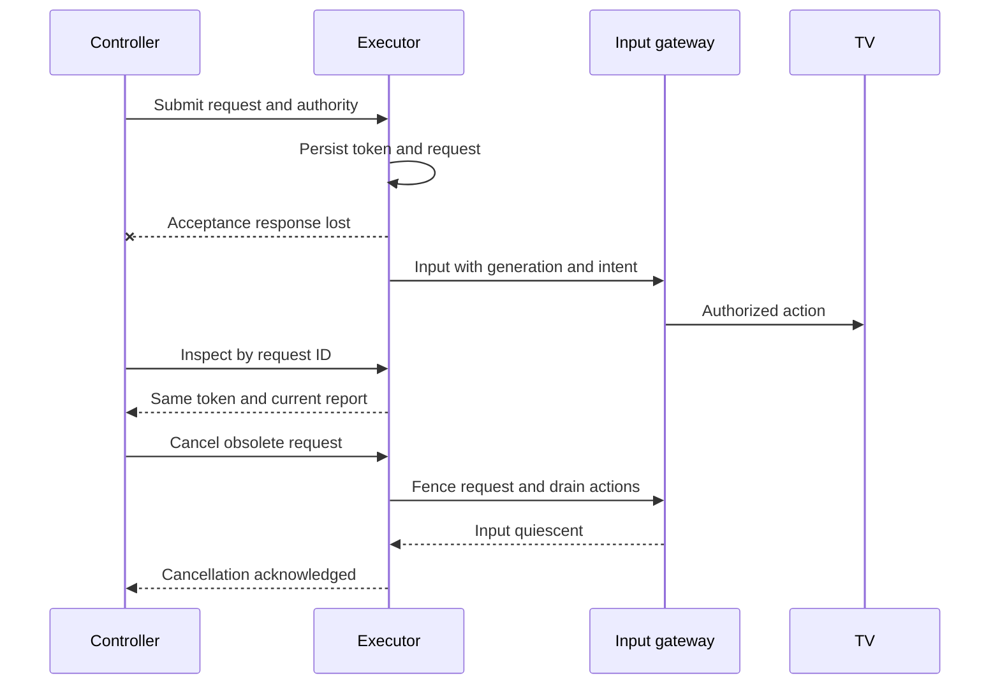

# Dillflix playback and content status API handoff

This guide is for the engineer building the service that navigates the Fire TV, verifies live playback, and supplies event or broadcast completion evidence. Build an asynchronous playback API with a durable token, a status API that separates navigation from actual playback and content lifecycle, and the recovery and ownership operations described below. The controller continues to decide **what** to watch; the executor decides **how** to open that content using every permitted viewing option.

**Status: proposed external contract for implementation review, dated 30 September 2026.** Existing product requirements and controller behavior are identified explicitly. The proposed HTTP routes, authority leases, response envelopes, and operational defaults are not implemented endpoints. The accompanying [OpenAPI draft](executor-api.openapi.yaml) describes the proposal and includes complete synthetic examples. It is not the running controller's `/openapi.json`.

The code baseline is [v0.8.0 at a81763c](https://github.com/Dillflix/dillflix-live-controller/tree/a81763c18fd86f03926ebc503060f0b9cc86c4eb). Read [current contracts](contracts.md), [architecture](architecture.md), and [manual control](manual-control.md) alongside this guide. The controller currently has a persistent simulated playback adapter, simulated/cached content status, real ADB screen mirroring, and real manual device input. A real autonomous executor and authoritative content-status transport are still absent.

## Product requirements to preserve

- **Live only.** Never select replay, start over, highlights, or a non-live filler. If an app presents “Watch live” versus “Start from beginning,” choose live. If live presentation cannot be established, report uncertainty or failure.
- **Protected manual commitments.** A user's watch plan survives delays, overtime, navigation failures, status outages, and disappearance from Teamarr discovery. Only the controller chooses another event or changes priority.
- **Original context.** Use the opaque Teamarr feed-entry `id` as `content_id`. Pass the complete original entry, including event/team/session/broadcast data and unknown extension fields. Do not reconstruct it from the web card or substitute `event.event_id`.
- **All permitted routes.** The controller supplies `allowed_viewing_options`. The executor can choose and retry within that set. `preferred_option_id` in the preserved snapshot has no special authority. A route failure never authorizes opening a different event.
- **Evidence rather than acknowledgements.** Accepting a job, injecting Select, opening the right app, or seeing a video surface does not prove the requested content is playing live.
- **One configured device initially.** Carry `device_id` everywhere; do not assume every future request refers to the same TV. The current ID is `living-room`.
- **Manual takeover wins input ownership.** Autonomous actions must stop when control is transferred. A closed browser disconnects input but does not itself end the timed manual override.

Estimated end times are planning hints. They do not establish completion. The status of a sporting event, the duration of a broadcast session, the selected coverage route, and the TV's playback health are different facts.

## Responsibilities and boundaries

| Component | Owns | Does not own |
| --- | --- | --- |
| Controller | Catalog, watch-plan order, eligibility, event selection, retry/fallback policy, durable desired intent | App navigation or model-specific perception |
| Playback executor | Route attempts, app navigation, cancellation, live/content verification, device observations | Sports priorities or removing reservations |
| Content-status provider | Lifecycle observations for a game or broadcast, provenance, freshness and corrections | Claims about what the TV is displaying |
| Device input gateway | Serialized, authorized physical input and handoff between manual and autonomous callers | Choosing sports content |
| Screen mirror | Live pixels for the interface and potentially a separately authorized observer | Automatic verification merely because capture works |

The executor and status provider can run in one service. They must preserve independent failure and freshness semantics. A healthy lifecycle provider may know that a game is live while the TV is offline; a healthy TV observer may see a stream while authoritative event status is unavailable.

## APIs to implement

The paths below belong to the **new external service**, not the controller's existing `/api/v1` routes. Polling is sufficient for the first integration; callbacks are optional.

| Priority | Method and path | Purpose |
| --- | --- | --- |
| Required | `POST /v1/playbacks` | Durably accept a live playback request and return its token |
| Required | `GET /v1/playbacks/{token}` | Read request progress, current matching playback evidence, and the requested content's lifecycle |
| Required | `GET /v1/playback-requests/{request_id}` | Recover the same token/report after a lost acknowledgement or controller restart |
| Required | `POST /v1/playback-requests/{request_id}/cancel` | Stop further navigation/recovery for that request, including cancellation before submission arrives |
| Required | `GET /v1/devices/{device_id}/observation` | Observe the current TV state independently of any historical token |
| Required | `POST /v1/content-status/lookup` | Check a reserved or retained event without requiring a playback token or changing the TV |
| Required before real input | `GET /v1/devices/{device_id}/authority` | Inspect durable ownership generation and advertised input capabilities |
| Required before real input | `PUT /v1/devices/{device_id}/authority` | Atomically transfer ownership and fence all older input |
| Required before real input | `POST /v1/devices/{device_id}/authority/renew` | Renew the current autonomous input lease without changing generation |
| Operational | `GET /healthz` and `GET /readyz` | Distinguish process health from readiness to accept durable work |

The authority routes specify the required behavior for a distributed deployment. If both input paths share the controller's process, equivalent calls into one shared gateway can replace this HTTP transport. Two separate locks around two independent ADB connections do not provide exclusive ownership.

**Useful later:** an explicit, guarded device-stop operation; SSE or signed callbacks for faster updates; batch content-status lookups; diagnostic evidence retrieval; and an administrative capability/device inventory. Do not make a generic shell-command endpoint part of this contract. Existing screen and manual-input routes already serve the web interface and should not be duplicated just to integrate navigation.

## Identifiers and token lifecycle

| Field | Issuer and scope | Meaning |
| --- | --- | --- |
| `content_id` | Teamarr feed | Stable identity of the requested game, session or broadcast; opaque |
| `device_id` | Deployment/controller | Configured target device, initially `living-room` |
| `request_id` | Controller | Unique immutable playback request and idempotency key |
| `intent_version` | Controller | Increasing selection intent within an authority generation |
| `token` | Executor | Opaque durable handle for exactly one accepted request |
| `generation` | Shared input authority | Increasing ownership generation that fences older processes and requests |
| `lease_id` | Shared input authority | Identifies an expiring grant of autonomous input authority |
| `owner_token` | Existing browser manual-control flow | Secret browser ownership credential; never reuse as a playback token or send to the executor |

Use an unpredictable, URL-safe playback token. It is an identifier, **not** the authentication credential: authenticate every read and mutation and scope access to the device/account. Tokens survive service restart. Repeating the same `request_id` and semantically identical immutable JSON returns the same token and the latest report; object-key order is irrelevant, array order is preserved. Reusing it with different data returns `409 idempotency_conflict`.

A token is not an event ID. A same-event route handoff or later recovery receives a new request and token. Old tokens continue describing their original request/content; they never silently point to a newer request. Their current playback observation is null/stale once the TV no longer matches. The old token's content status can continue updating through the independent status provider.

**Proposed retention:** retain active token records throughout their lifetime and inactive records for at least 30 days after retirement. Expose `retained_until`; use `410` for known expired records and `404` for genuinely unknown identities. Never recreate device actions merely because a full job record was pruned. Keep cancellation tombstones and authority/intent high-water marks sufficient to reject all replayable requests. Expired execution deadlines provide an additional bound, not a replacement for durable fencing.

## Initiating playback

`POST /v1/playbacks` receives an envelope with two parts:

```json
{
  "request": {
    "schema_version": 1,
    "request_id": "req-example-001",
    "device_id": "living-room",
    "intent_version": 23,
    "content_id": "opaque-feed-entry-id",
    "mode": "live",
    "purpose": "selection",
    "previous_request_id": null,
    "content_snapshot_schema_version": 1,
    "content_snapshot": {"id": "opaque-feed-entry-id"},
    "allowed_viewing_options": [{"id": "option-example-001"}]
  },
  "execution": {
    "generation": 12,
    "lease_id": "lease-example-012",
    "issued_at": "2026-09-30T20:00:00Z",
    "deadline_at": "2026-09-30T20:02:00Z"
  }
}
```

The snapshot and option above are abbreviated **only for explaining the envelope**; they are not a production request. The OpenAPI example contains a complete synthetic Teamarr-shaped entry. Production forwards the actual original entry and every allowed original option unchanged. Preserve provider identifiers, names, aliases, abbreviations, team details, artwork, timing, broadcast metadata, review reasons, and extension fields. Treat metadata as data, including if it is supplied to an LLM; it cannot override the live-only, ownership, or route restrictions.

`request` matches the controller's existing staged payload. `execution` is a proposed addition: persist it with the request before sending and reuse it unchanged for retries. A renewed lease extends the same `lease_id`; a new authority generation requires a new request. Do not attach today's authority credentials to an old queued request and thereby revive it.

Before creating work, validate authentication, device binding, schema, `content_id == content_snapshot.id`, a nonempty permitted option set, live-only mode, intent uniqueness, current autonomous authority, and an unexpired deadline. A new higher intent supersedes lower pending work on the device. An equal intent with a different request is a conflict. Check deduplication before rejecting an already-recorded request for an expired deadline/lease: returning its existing report is safe and must not restart it.

The preserved snapshot can contain an old or unknown lifecycle even when the controller has newer independent live evidence. Do not treat `content_snapshot.status` as the sole authority for accepting or verifying playback. An unknown coverage end is also not proof that an option is invalid. Resolve review uncertainty against the live destination or a real source, and report what was actually established.

Return `202 Accepted`, a `Location` header pointing to the token URL, and an initial report **after** the token, payload, ownership constraints, and queued work are committed durably. This acknowledges acceptance, not playback. Return `200` for an identical retry. Navigation runs outside the HTTP request, within the original deadline, and cannot continue indefinitely after the controller gives up.

During navigation, try permitted options within that deadline. Record an attempt number, `viewing_option_id`, progress phase, start/end times, and a bounded error code/reason. Useful phases include `opening_app`, `finding_content`, `choosing_live`, and `verifying`. Do not claim exact percentage progress if it is not meaningful. Fail promptly for unsupported targets or unavailable live coverage; return `needs_user_action` as an error code when sign-in or another user interaction is required. Do not make purchases or alter subscriptions as a recovery step.

## Reading status using the token

The report contains three independent answers:

| Field | Question | Key rule |
| --- | --- | --- |
| `operation` | What happened to this launch request? | Historical success can remain true after playback stops |
| `observation` and `observation_status` | Is this request's content currently verified on the TV? | Evidence expires; null does not mean the event ended |
| `content_status` | What is the lifecycle of this content? | Completion is independent of launch or device failure |

Example after verification, with lifecycle evidence still unavailable:

```json
{
  "schema_version": 1,
  "token": "pb-example-001",
  "request_id": "req-example-001",
  "device_id": "living-room",
  "content_id": "opaque-feed-entry-id",
  "intent_version": 23,
  "generation": 12,
  "revision": 7,
  "operation": {
    "state": "playing_verified",
    "phase": "verified",
    "created_at": "2026-09-30T20:00:00Z",
    "updated_at": "2026-09-30T20:00:09Z",
    "finished_at": "2026-09-30T20:00:09Z",
    "deadline_at": "2026-09-30T20:02:00Z",
    "error": null,
    "attempts": []
  },
  "observation": {
    "device_id": "living-room",
    "request_id": "req-example-001",
    "intent_version": 23,
    "generation": 12,
    "content_id": "opaque-feed-entry-id",
    "viewing_option_id": "option-example-001",
    "presentation": "live",
    "verified": true,
    "simulated": false,
    "health": "healthy",
    "observed_at": "2026-09-30T20:00:10Z",
    "valid_until": "2026-09-30T20:00:25Z",
    "evidence": {
      "method": "device_observation",
      "evidence_id": "obs-example-042",
      "summary": "Requested identity and live presentation independently matched",
      "confidence": null
    }
  },
  "observation_status": {"state": "fresh", "checked_at": "2026-09-30T20:00:10Z", "error": null},
  "content_status": {
    "content_id": "opaque-feed-entry-id",
    "lookup_state": "unavailable",
    "effective_state": "unknown",
    "stale": true,
    "observation": null,
    "checked_at": "2026-09-30T20:00:10Z",
    "error": {"code": "status_source_unavailable", "message": "Lifecycle evidence is unavailable", "retryable": true}
  },
  "cancellation": {"state": "none", "input_quiescent": false},
  "retained_until": null
}
```

`operation.state` is `accepted`, `navigating`, `playing_verified`, `failed`, `cancelled`, `superseded`, or `timed_out`. Keep the existing `playing_verified` spelling for adapter compatibility; it means the navigation job succeeded at least once. It is not a promise of ongoing playback. `finished_at` records job completion, never event completion. A successful job can be quiescent while passive observations continue. `cancellation.input_quiescent` specifically reports a cancellation barrier; false with `state: none` makes no assertion that input is currently occurring.

An ordinary launch transitions `accepted` to `navigating` to `playing_verified` or `failed`. Cancellation, supersession, and deadline expiry can terminate pending work. A terminal operation never restarts under the same token. Later playback loss changes observations; a new recovery request gets a new token. Do not add a generic `completed` boolean that could mean either job success or game completion.

`observation_status.state` is `fresh`, `stale`, or `unavailable`. Preserve original evidence timestamps. When evidence expires, set `verified: false` in the returned stale observation or return null, and label it stale. Never refresh timestamps simply because the endpoint was polled. A status read may trigger a bounded observation check or return a cache, but it must not send navigation keys, restart a job, or recover playback by itself.

Use a monotonically increasing report `revision` for accepted changes. Return `Cache-Control: no-store`. Recommended polling is once per second during navigation and every 2–5 seconds while monitoring playback; lifecycle refresh can be slower. Rate limits should return `429` with `Retry-After`. An unavailable lifecycle source should be represented inside an otherwise successful token report, rather than making device progress inaccessible.

## What counts as verified playback

A verified observation must establish the requested identity, the chosen permitted viewing option, live presentation, and healthy playback on the correct device. Include an evidence reference and acquisition time. The requested title in the navigation prompt is not independent evidence of success.

Useful inputs include app/player telemetry, live-edge state, channel/program identifiers, scoreboard/team/competition observations, and temporal evidence that playback is progressing. Each implementation must explain which signals it actually has. Motion alone does not establish the right content; a familiar matchup alone does not distinguish replay; a visible play button does not establish playback. Commercial breaks and static graphics can occur during healthy live coverage, so absence of motion alone is not enough to report a dead stream.

The current controller accepts playback evidence for at most **15 seconds**, honors an earlier `valid_until`, and rejects timestamps more than five seconds in the future. Sample often enough to support that budget—approximately every five seconds is the proposed starting point. Separate acquisition time from response-generation time. A long-running inference over an old frame can already be stale when it finishes. If reliable inference cannot meet the budget, agree on a layered telemetry/vision design or explicitly change the controller's freshness policy; do not manufacture fresh evidence.

Observations must match device, request, intent, content, and the allowed option set, and the option must still be compatible with current coverage. The external contract adds authority generation; the controller adapter must validate it too. A mismatch, replay, unknown presentation, expired observation, menu, buffering, or black/protected capture yields unverified evidence with a reason. It never yields `ended` merely because the target is no longer visible.

`GET /v1/devices/{device_id}/observation` is necessary because token reports describe a particular historical request. The device can now be showing another request, a manually selected program, or an unidentified screen. Return the actual observation, with nullable request/content fields when unknown, rather than copying the last requested target. A verified observation requires all correlation fields to be present. The controller must re-observe or issue a new eligible request when returning from manual control.

## Content lifecycle and completion

Supported lifecycle states match the controller: `scheduled`, `live`, `delayed`, `suspended`, `postponed`, `ended`, `cancelled`, and `unknown`. Supply optional `phase`, `actual_end_time`, and revised schedule fields when known. Halftime, intermission, a commercial break, overtime, and a temporary suspension do not imply `ended`.

`POST /v1/content-status/lookup` accepts the existing lookup payload: `schema_version`, lookup `request_id`, `content_id`, `content_snapshot_schema_version`, the original `content_snapshot`, `catalog_seen_at`, and `as_of`. It returns the echoed lookup/content identity and a `content_status` object in the same shape used by the token report. `as_of` does not authorize a real source to invent historical or future state; production uses current real UTC. A request can be resolved using structured provider IDs in the snapshot without parsing `content_id`.

This lookup is required even if token status also includes lifecycle. Reservations may never have been played, the active TV may be watching something else, and events can leave the feed window. None should require navigating the TV just to learn whether an event is live or finished. If video is the only evidence source and the event is no longer observable, report unknown/unavailable unless an independent source can resolve it. State this capability limit explicitly.

| Evidence situation | Required interpretation |
| --- | --- |
| Fresh authoritative final status for the requested game | `ended`, with source and observation time |
| A visual model suspects completion | Candidate evidence; keep lifecycle `live` if supported by other fresh evidence, otherwise `unknown` |
| Final score from a different game or a replay | Does not complete the requested content |
| RedZone still covers other games | A constituent game ending does not complete RedZone |
| One golf coverage route ends while the session continues | Route availability changed; content need not have ended |
| Estimated end passed, feed entry disappeared, video disconnected | No completion conclusion |
| Explicit cancellation | `cancelled`, distinct from a played event reaching its end |
| A confirmed final is later corrected by a newer explicit source observation | Publish the correction with provenance; do not make terminal state irreversible |

For video-based completion, include a bounded evidence record: method/model or policy version, source/frame/clip reference, capture time, content association, whether the result is `candidate` or `confirmed`, and an optional calibrated confidence. A confidence value alone is not a completion policy. Require a documented confirmation rule validated against football and hockey examples, including end-of-period graphics, overtime, postgame, ads, and unrelated highlights. Start candidate detections in shadow mode. Only a policy-confirmed result may map to `state: ended`.

Define the completion scope as the requested **content**, not automatically “everything the channel airs afterward.” For an ordinary game, the proposed rule is actual game finality; postgame coverage does not extend its lifecycle. For a broadcast/session such as RedZone, use that broadcast/session's end. This scope is a product decision to confirm before enabling automatic switches.

Content observations include `source`, `simulated: false`, `timestamp_basis`, `observed_at`, `received_at`, and `valid_until`. Proposed real bases are `provider` and `device_observed`. The latter requires an explicit extension to the current validator, which today recognizes only `provider`, `fixture`, and `feed_received`. Never mislabel video evidence as a fixture or disguise cached feed receipt as a provider observation.

The current content evidence budget is **120 seconds**, with a default lookup cadence of 15 seconds and a five-second lookup timeout. Fresh unknown is different from lookup failure. Failure/null preserves still-valid previous evidence; expired nonterminal evidence projects to unknown. Confirmed `ended`/`cancelled` facts already accepted by the controller survive outages, while a newer explicit observation can correct them. Preserve `actual_end_time` separately from the time a source reconfirms final status.

A newly received, already-expired terminal observation is currently rejected by the controller validator. Revalidate against an actual source or agree on a separate trusted historical-import path; do not rewrite its observation timestamp to get it accepted. Polling cached evidence is not revalidation.

## Reliable retries and cancellation



If submit times out, its outcome is unknown. Inspect by `request_id`; if genuinely absent and the original deadline/authority remain valid, retry the identical envelope. Never generate a new request ID merely because the HTTP response was lost. The durable job must be written before any device input.

Cancellation is addressed by request ID because the token may never have reached the caller. Accept `{device_id, generation, intent_version}` and persist a tombstone even if the original submission has not arrived. Cancellation of an old generation is still permitted for its own request by an authorized controller; it must not require granting that old generation renewed input authority. Reject conflicting identity for an existing request.

Return `202` while actions are draining and `200` only when the request is durably fenced and can issue no further input. The body reports `state: requested|acknowledged` and `input_quiescent`. Repeated cancellation is idempotent. If a tombstoned request arrives later, it remains cancelled and emits no input. In-flight low-level writes may already have reached the TV; acknowledgement guarantees the handoff boundary, not rollback of the past action.

Cancellation stops navigation and autonomous recovery for that request. It does **not** send a global Stop key, stop already-playing content, or affect a newer request. An executor that wants to recover a stream after a job has succeeded needs a new controller-authorized request; token polling must not secretly revive navigation.

The controller currently retries cancellation until `cancel()` returns successfully. An HTTP adapter must treat `202` as pending, not acknowledged, and avoid blocking its worker while waiting for quiescence.

## Manual control and shared input authority

This is an integration gate, not an optional polish item. v0.8.0 fences manual key/text writes with a local lock, owner credential, and deadline. It also pauses/cancels the simulated coordinator. Those checks cannot stop an external navigator that owns an unrelated ADB connection.

**Recommended design:** one gateway owns all application-controlled input for each device. Both the manual bridge and autonomous executor pass through it. Keep capture separate. The gateway serializes authority changes with input dispatch; it checks generation, intent, request cancellation, lease expiry, and owner immediately before each write. Checking once at job admission, or calling a remote permission check and later writing through another connection, leaves a race.

The authority resource has mode `autonomous`, `manual`, or `paused`, a server-issued increasing `generation`, an optional lease, and `input_quiescent`. `PUT` carries a unique `command_id`, `expected_generation`, desired mode, and an opaque manual `session_id` plus deadline when applicable. It compares and changes generation atomically. Record the command receipt so a lost response and retry cannot transfer ownership twice. An autonomous grant has a proposed 30-second lease, renewed every ten seconds; lease loss stops further input but need not stop video already playing. An expired lease cannot be revived by renewal; obtain a new generation.

Authority transfer can return `202` while old writes drain. New input remains blocked until `GET` reports the new generation and `input_quiescent: true`, or the mutation returns `200` with that state. A matching-generation renewal does not increment generation or change mode, and repeated renewal with the same command ID does not extend twice. Only the trusted controller orchestration identity can transfer authority; browser session IDs are references, not service credentials.

Takeover sequence:

1. Persist the manual intent, pause autonomous scheduling, advance controller intent, and request authority transfer to the manual session.
2. Fence every prior autonomous generation/request, discard queued writes, release any held inputs, and drain outstanding writes.
3. Only after the gateway confirms quiescence enable the manual remote. If the gateway is unreachable, show takeover pending/unavailable; do not open an independent manual input channel that could race the executor.
4. Keep schedule/status refresh and watch-plan edits running during the override. Browser disconnect closes input, while the manual deadline remains in force.
5. On release/expiry, disable manual input and transfer to paused or a new autonomous generation according to the saved return mode. Lease/gateway expiry alone must never automatically resume automation.
6. Invalidate old playback claims, reevaluate current eligibility, and obtain fresh evidence or stage a fresh request. Never relabel pre-takeover evidence as current.

Authority generation must survive controller and executor restarts and restores. On restore, keep automation paused, read the gateway's generation, and explicitly establish new authority before real input. Do not assume a restored controller database has the highest counter. Physical remotes and independently running ADB/ws-scrcpy clients remain outside this guarantee; observe unexpected changes honestly.

## Coverage changes and outage behavior

The controller already creates a new intent/request for the same event when an active route is withdrawn or its locator changes. The executor receives the new complete snapshot and valid options. Use `purpose: route_handoff` or `recovery` and `previous_request_id` for diagnostics; they do not relax verification or fencing. The controller preserves viewing timers when the event identity stays the same.

Route compatibility currently compares `id`, `app`, `channel`, `stream_title`, `listing_url`, `broadcast_id`, `presentation`, and `coverage_type`. Option reordering, extra alternatives, display metadata changes, and estimated end changes alone do not require a handoff. Future in-place option updates are unnecessary for v1: supersede with a new immutable request.

Keep three outages separate: service unreachable, device unreachable, and lifecycle source unavailable. `readyz` is about the service's ability to accept and persist work; one offline TV need not make the entire service unready. A successful device-observation response with unavailable evidence proves service contact, not healthy playback. Preserve the last evidence timestamps and independent errors in token/device reports.

Current controller defaults are a 120-second navigation deadline, a 60-second grace after playback evidence loss, increasing recovery waits up to 300 seconds, and service probes at 5, 10, 20, 40, then 60 seconds. Manual intent remains saved throughout. After an outage, recheck latest authority and intent before any queued action. Never replay old key sequences blindly after reconnecting.

An explicit device-stop API is useful, but **waiting** and **automation paused** do not currently mean “send Stop to the TV.” Keep that behavior undecided until the product rule is confirmed. If added, require a new command ID, current authority/intent, and an expected current request/token so a delayed stop cannot interrupt newer playback. Never overload cancellation with stop semantics.

## HTTP behavior and operational defaults

| Situation | Response |
| --- | --- |
| Durable new asynchronous work | `202`, token/report and `Location` |
| Identical existing request or completed read | `200` |
| Malformed JSON or invalid fields | `400` or `422`; no input |
| Missing/insufficient service credentials | `401` or `403`; no input |
| Unknown request/token/device | `404`; content lookup absence is represented in its result |
| Known expired token | `410`; never interpreted as event completion |
| Different payload for same ID, stale intent/authority, expired deadline | `409` with a specific code |
| Rate limit | `429` and `Retry-After` |
| Cannot durably accept work or service temporarily unavailable | `503` and `Retry-After` when known |

Use `application/problem+json` for HTTP failures, with `type`, `title`, `status`, `detail`, a stable `code`, and `retryable`. An accepted request that subsequently fails returns `200` on status reads with `operation.state: failed` and an embedded error; it is not itself an HTTP 500. `retryable` describes transport/transient eligibility, never blanket permission to replay device input.

Recommended initial limits are a one-MiB JSON body, one active navigation per device, a two-second HTTP connection timeout, a five-second total request timeout, and a five-second status-provider budget. Accept/store the job quickly; do not keep POST open while navigating. Validate these proposed defaults against the deployment and report latency. Preserve the controller's existing five-second status lookup ceiling unless changed deliberately.

Use service-to-service authentication independent of browser nginx authentication. A scoped bearer credential over a protected transport is the draft default; deployment may choose mTLS. Keep secrets in configuration, never the source snapshot or token URL. Allowlist configured devices and app routes; do not turn metadata URLs or model output into unrestricted shell/network execution. This applies specifically to the new device-control boundary, not to whether the web UI can bind to the LAN.

Log request/token/device/content/intent/generation, route attempts, state changes, error codes, observation age and cancellation latency. Do not log raw credentials, manual text, or complete snapshots by default. Store evidence only under an explicit retention policy; an evidence ID can reference short-lived diagnostics. Distinguish successful input transport from a verified app response.

## Mapping into the current controller

| Current boundary | External mapping and required work |
| --- | --- |
| `PlaybackAdapter.submit(request)` | Persist execution envelope, POST it, save token, flatten `operation.state`, map token to `executor_job_id` |
| `PlaybackAdapter.inspect(request_id)` | Recover/read report by request ID; return null only for genuine absence, never on timeout/auth failure |
| `PlaybackAdapter.cancel(request_id)` | Resolve persisted identity, call cancellation, acknowledge internally only after quiescence |
| `PlaybackAdapter.observe(device_id)` | Read actual device evidence, validate identity/generation/freshness; distinguish service error from available service with null evidence |
| `ContentStatusAdapter.lookup(request)` | POST independent lookup, echo original lookup ID; map observation into existing report shape and retain unavailable/error distinction |
| `Controller(settings, playback=…, status=…)` | Inject real adapters; add explicit configuration and keep simulator selectable for regression/demo use |
| `controller/config.py` | Add endpoint/auth/timeouts and adapter selection; catalog mode is not executor mode |
| `controller/coordinator.py` | Persist authority/envelope/token mapping; validate generation; handle timeout/supersession/cancellation deliberately |
| `controller/manual_control.py` and `device_input.py` | Integrate the shared gateway and pending takeover before permitting real parallel input |
| `controller/content_status.py` | Add reviewed `device_observed` basis and confirmation semantics; retain current freshness/correction protections |
| Service metadata, activity and frontend labels | Replace hardcoded simulation claims with actual adapter provenance; do not blanket-change everything to “real” |

**Concurrency work is required.** The playback protocol is synchronous and `run_worker()` calls `tick()` directly inside an async loop. Replacing simulator calls with blocking HTTP would block that event loop, potentially delaying manual input, expiry, and screen streaming. Refactor the network boundary to await bounded asynchronous I/O or use a controlled worker/thread boundary, keeping database transactions short and rechecking leases/intent after results return. A navigation deadline alone does not interrupt a blocked HTTP call.

`inspect_playback()` already requests a device observation after a historical `playing_verified` report. Preserve that reconciliation. Update the current generic report failure mapping to distinguish expected supersession/cancellation from a route failure. Return real observations with `simulated: false`, but only when backed by real evidence.

Envelope binding must be durable across restarts. Add a reviewed migration or side table keyed by request ID for the immutable execution envelope and token mapping; do not mutate an already-issued payload on a retry. Source and response schema versions, database migrations, and token retention are separate concerns.

## Acceptance scenarios

These are integration requirements, not a claim that the new service has passed them. Exercise both the API transport and the physical-input boundary.

| Scenario | Required result |
| --- | --- |
| Happy path | One request/token; permitted route; fresh correct live evidence before verification |
| Lost POST response | Request-ID inspection or identical retry returns same token without duplicate navigation |
| Same ID with changed snapshot/options/deadline | `409`; no new input |
| Executor dies after durable acceptance | Job/token recovered; reconcile device before continuing uncertain actions |
| Lower intent arrives after a newer one | No input and no change to newer playback |
| Equal intent with different request | Conflict rather than two navigation owners |
| Cancel arrives before submit | Durable tombstone; later submission emits no input |
| Cancellation of old token while a newer one plays | Newer playback unaffected |
| Stalled navigation or expired deadline | No actions past authority/deadline; meaningful failure; reservation retained |
| Replay or wrong game opens | Verification rejected; try another permitted route within budget or fail |
| Unknown/live-edge evidence missing | Unverified; never label live solely from the requested mode |
| Static graphic, ad, halftime or hockey intermission | No unsupported event-completion claim |
| Football overtime or hockey overtime/shootout | Remains live until explicit confirmed completion |
| RedZone constituent game final | Broadcast remains independent of that game's result |
| Selected route withdrawn during navigation/playback | New request fences old route; same-event identity retained |
| Playback evidence older than 15 seconds | Unverified/stale; polling does not refresh timestamps |
| Status provider unavailable | Still-valid old evidence preserved, then nonterminal unknown; no lost reservation |
| Reserved event never played or outside discovery | Independent lookup works without token or device navigation |
| Terminal correction and conflicting evidence | Newer justified correction accepted; uncertainty does not erase known finality |
| Video-only source after channel change | Reports unsupported/unknown for unobservable content, not fabricated continuity |
| Manual takeover races an autonomous key | No manual input until old generation drains; no old input after handoff acknowledgement |
| Browser disconnects during manual override | Input closes; override remains until its deadline or explicit release |
| Release while automation was previously paused | Remains paused unless user explicitly resumes |
| Controller restore with old counters | New gateway generation required; old requests cannot revive |
| Service healthy but TV offline | Clear device-unavailable evidence without false service readiness or playback claims |
| Token pruned and old POST replayed | `410`/fence/deadline prevents duplicate device effects |
| Independent services restart during handoff | Authority stays fail-closed; no dual ownership |

Measure launch latency, false-positive live verification, false-positive completion, observation freshness, request deduplication, cancellation quiescence latency, and recovery time. False completion can cause a missed ending, so evaluate it separately from generic model accuracy. A model benchmark or browser screen test does not establish exclusive input ownership or actual Fire TV correctness.

## Delivery sequence and decisions

1. Agree on completion scope, service topology, token retention, real observation capabilities, and the shared input gateway.
2. Implement durable acceptance, request-ID recovery, token reports, cancellation, and a deterministic executor test double against the OpenAPI draft.
3. Implement real authority transfer/renewal and manual handoff; prove fencing under races and restarts before enabling autonomous ADB input.
4. Add real navigation and independent playback observations for the initial live routes. Validate actual Fire TV screens, buffering, wrong content, and live versus replay.
5. Add independent lifecycle lookup. Run completion detection in shadow mode, inspect football/hockey false positives, then enable confirmed lifecycle output.
6. Integrate real controller adapters and migrations, exercise the acceptance matrix, then run supervised and unattended host trials with rollback to the simulator available.

| Decision to confirm | Recommended starting point |
| --- | --- |
| Completion scope | Actual game end for games; session/broadcast end for broadcast content; no automatic postgame extension |
| Combined or separate services | One external facade is convenient; preserve independent playback and lifecycle observations internally |
| Input ownership topology | One shared physical-input gateway for manual and autonomous commands |
| Observation performance | Fresh playback evidence every five seconds; retain current 15-second controller budget |
| Status source capability | Provider lookup where available; video inference with explicit confirmation and unknown when unobservable |
| Authority availability | 30-second autonomous lease renewed every ten seconds; fail closed for new input |
| Token retention | Active lifetime plus at least 30 days inactive, with longer fencing/tombstone guarantees |
| End behavior with no next live item | Keep controller waiting semantics; add physical stop only after its behavior is explicitly chosen |

These defaults make the proposed API concrete, but are not evidence that a device, provider, or model can satisfy them. Resolve capability gaps before claiming production readiness.

The accompanying draft was checked as OpenAPI 3.1, all 14 component examples were validated against their schemas, and the guide's full status example was checked against the same response schema. This validates the contract artifact, not an implementation. Timestamp ordering, identity equality, authority barriers, and actual evidence quality still require semantic and integration tests.

## Source references

- [Playback interface and persistent simulator at the reviewed commit](https://github.com/Dillflix/dillflix-live-controller/blob/a81763c18fd86f03926ebc503060f0b9cc86c4eb/controller/playback.py)
- [Coordinator identity checks and delivery behavior](https://github.com/Dillflix/dillflix-live-controller/blob/a81763c18fd86f03926ebc503060f0b9cc86c4eb/controller/coordinator.py)
- [Content evidence validation and freshness](https://github.com/Dillflix/dillflix-live-controller/blob/a81763c18fd86f03926ebc503060f0b9cc86c4eb/controller/content_status.py)
- [Manual ownership](https://github.com/Dillflix/dillflix-live-controller/blob/a81763c18fd86f03926ebc503060f0b9cc86c4eb/controller/manual_control.py) and [physical input gateway](https://github.com/Dillflix/dillflix-live-controller/blob/a81763c18fd86f03926ebc503060f0b9cc86c4eb/controller/device_input.py)
- [HTTP semantics including asynchronous acceptance](https://www.rfc-editor.org/rfc/rfc9110.html#name-202-accepted)
- [Problem details for HTTP API errors](https://www.rfc-editor.org/rfc/rfc9457.html)
- [OpenAPI 3.1 specification used by the accompanying draft](https://spec.openapis.org/oas/v3.1.0.html)
